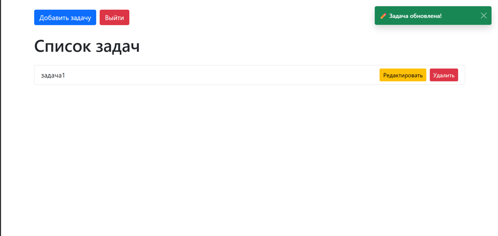
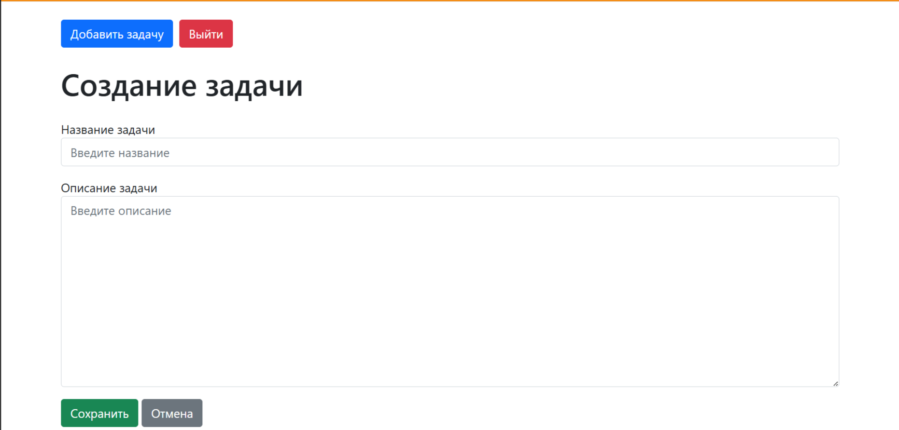
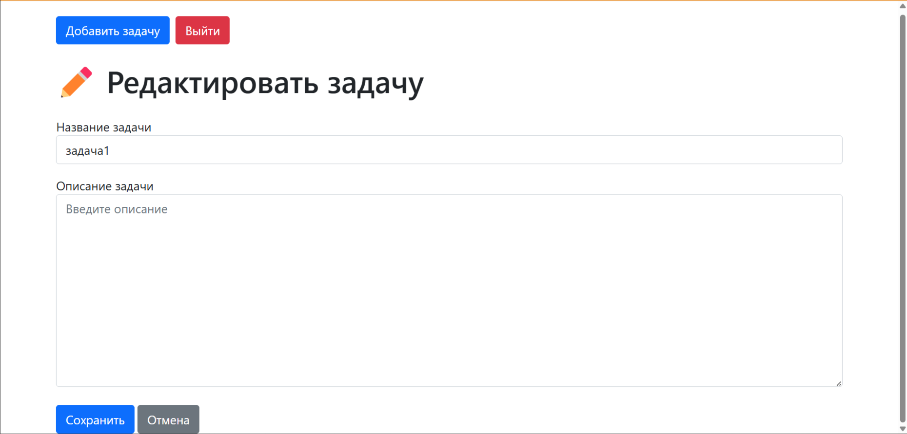
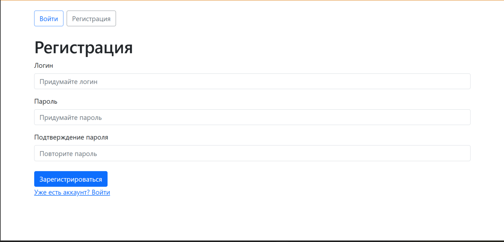
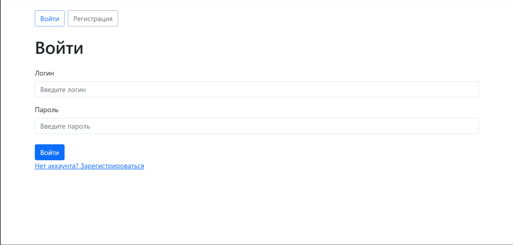

# Django Task Manager (TODO List)

A simple yet functional **Task Manager** web application built with Django.  
Create, view, edit, and delete tasks with user-friendly notifications and Bootstrap styling.

## Features

- Add new tasks (title + optional description)
- View all tasks in a clean list
- Edit existing tasks
- Delete tasks with confirmation
- Success/error notifications using Django messages and Bootstrap toasts
- Responsive design with Bootstrap 5

## Screenshots 📸

*Авторизованный пользователь видит только свои задачи*

*Форма с кастомной валидацией (запрет грубых слов)*

*Редактирование*

*Регистрация*

*Вход*

## Database
- SQLite (default for quick local development)
- Full PostgreSQL support added:
  - Switched from SQLite to PostgreSQL (`todo_database`)
  - Configured via `.env` (DB_NAME, DB_USER, DB_PASSWORD, etc.)
  - Proper user permissions and schema access set up
  - Migrations applied successfully
  - Easy to switch back or use in production

## Tech Stack

- Python 3.10+
- Django 6.0+
- Bootstrap 5.1+
- SQLite (default, easy switch to PostgreSQL)
- python-dotenv for configuration

## Quick Start (Local Setup)

1. Clone the repository
2. Create and activate a virtual environment
3. Install dependencies
4. Create a .env file in the root directory
5. Apply migrations
6. Run the development server 🎉

